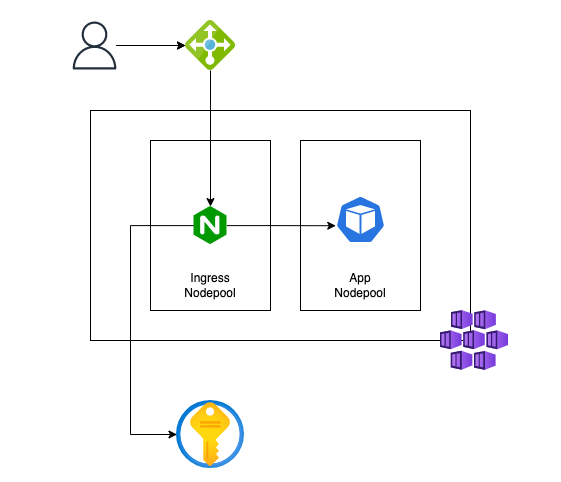

# About this project

The goal of this repository is to show how to deploy an autoscalable [kubernetes/ingress-nginx](https://kubernetes.github.io/ingress-nginx/) on a dedicated AKS nodepool with **Azure Key Vault**  integration.

## Architecture



## Usage

### Create the infrastructure

```
$ az login
$ cd terraform
$ terraform plan -var 'ingress-controller-demo-rg=<resource_group_name>'
$ terraform apply -var 'ingress-controller-demo-rg=<resource_group_name>'
$ az aks get-credentials --name ingress-controller-demo --resource-group <resource_group_name>
```

### Create a self-signed certificate in **Azure Key Vault**

```
$ cd ..
$ az keyvault certificate create --vault-name <keyvault_name> -n nginx-ingress-demo-local -p @cert-policy.json
```

### Deploy the **SecretProviderClass** that is going to be used by **ingress-nginx**

```
$ export KEYVAULT_CLIENT_ID=$(az aks show --name ingress-controller-demo --resource-group <resource_group> --query addonProfiles.azureKeyvaultSecretsProvider.identity.clientId -o tsv)
$ export KEYVAULT_TENANT_ID=$(az keyvault show --name <keyvault_name> --query properties.tenantId -o tsv)
$ export KEYVAULT_NAME=<keyvault_name>
$ envsubst < secret-provider-class.yaml.template | kubectl apply -f -
```

### Install the **ingress-nginx** controller with custom settings

The ```nginx-ingress-settings.yaml``` file configures our Ingress Controler with autoscaling enabled, mounts the **Key Vault Secret Store** and sets it to run on a dedicated nodepool. 

```
$ helm repo add ingress-nginx https://kubernetes.github.io/ingress-nginx
$ helm repo update
$ helm install ingress-nginx/ingress-nginx --generate-name -f nginx-ingress-settings.yaml
```

### Deploy our demo app and its ingress resource

```
$ kubectl apply -f app-deployment.yaml
$ kubectl apply -f app-ingress.yaml
```

### Test it using **curl**

```
$ INGRESS_IP_ADDRESS=$(kubectl get ingress helloworld-nginx-ingress-demo -o=jsonpath='{.status.loadBalancer.ingress[0].ip}')
$ curl -v --insecure --resolve helloworld.nginx-ingress-demo.local:443:$INGRESS_IP_ADDRESS https://helloworld.nginx-ingress-demo.local
```

Reference docs: 

https://docs.microsoft.com/en-us/azure/aks/csi-secrets-store-nginx-tls

https://kubernetes-csi.github.io/docs/

https://github.com/kubernetes/ingress-nginx/blob/main/charts/ingress-nginx/values.yaml